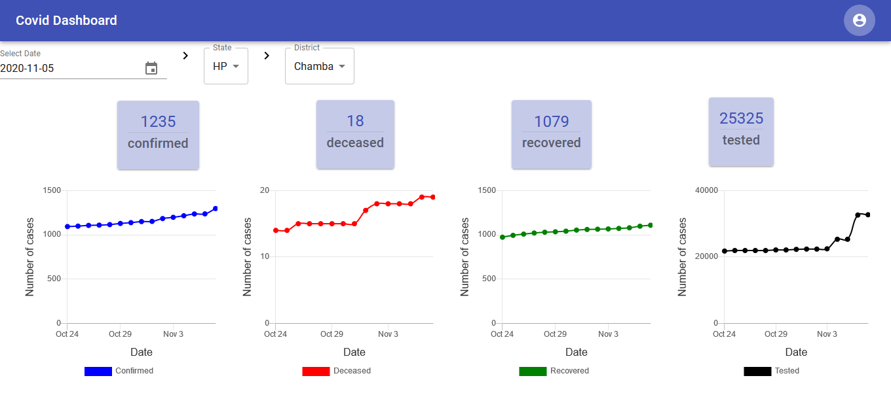
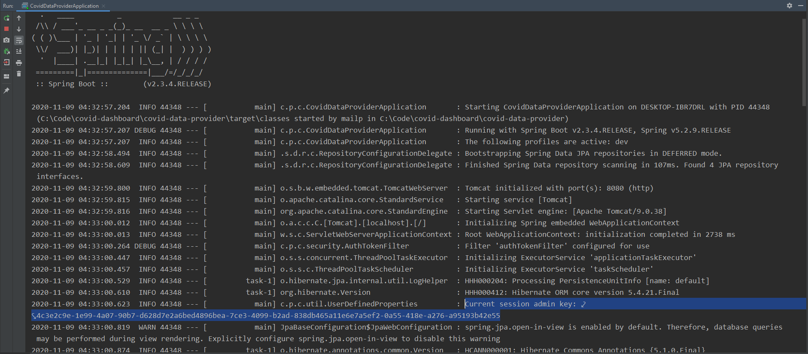
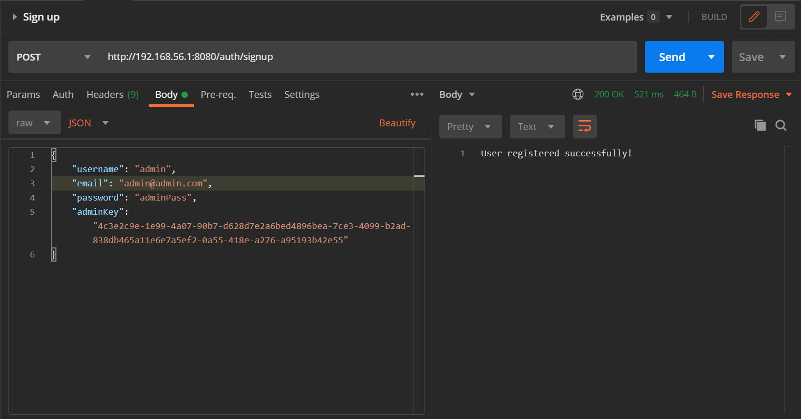

# Covid-dashboard
Dashboard to visualize Covid19 India Data, with User login/Registration.

### Components:
The Covid Dashboard system has mainly 3 components.


- The UI is written mainly using ReactJS library, and it exposes few endpoins like `/login`, `/home` to interact with system.
- Backend API is written in Spring boot and handles below major operations:
    - Providing user registration and login endpoints, which uses jwt based authentication and Role based Authorization.
    - Pools data from covid data provider API and persists in DB.
    - Performs database setup tasks like setting up Roles, creating tables using JPA etc.
    - Details of each api call is saved as postman request in `api-collection` folder of this repository.
- The database component is a basic postgres server with public schema

#### How to run locally:
1. Setup postgres server with default public schema and database name as `coviddb`, we'll use it to persist api data.
2. Create below env variables with appropriate values in the system where you want to run `covid-data-provider` API
    - `COVID_DB_HOST` : `coviddb` hostname or ip address
    - `COVID_DB_USER` : Database user having admin priviledge 
    - `COVID_DB_PASS` : Password for `COVID_DB_USER`
    - `JWT_SECRET`    : Some unique string which will be used to encrypt user information in JWT. e.g, `adfnhjsnvnvnnvfnknsvnkjlnvzjnfvnzsln` you get it anything which an attacker cant guess easily.
    - `API_HOST`      : Host address of server where our Backend API will be running. We'll use this address to setup UI-Dashboard
3. After cloning this repo, follow below steps(basic steps for a maven based project):
    ```sh
    cd covid-data-provider
    mvn clean package
    java -jar target\covid-data-provider-0.0.1-SNAPSHOT.jar
    ```
- The service will create appropriate tables in Database and load initial data
- [Optional] There are few configurations in `covid-data-provider\src\main\resources\application.yml` which you can tweak to control the setup, viz:
    - `covid19india.timeTravelMinusDays` : number of past days to skip from today, it's needed as in some cases covid19india API does not get updated regularly. `2` is a good value for this property
    - `covid19india.pastDataInNumberOfDays` : total number of days we want to pull data from covid19india API. As whole API data polling might take a while as the covid19india API consists data starting from Feb'2020.
    - `auth.jwtExpirationMs` : jwt token expiry duration in Milliseconds, from the instant it's been genearted through `/signin` endpoint

4. Update `baseURL` to `COVID_DB_HOST` configured in Step 2 from file `dashboard\src\_api\covid-internal\internalapi.js`
5. Now you can run UI Dashboard using below commands: 
    ```sh
    cd dashboard
    npm install
    npm run start
    ```
6. Visit default url `http://localhost:3000` to login/signup a new user.
    - Upon successful login you'll be presented with dashboard, where you can select date/state/district to view data/graph.
    - The graphs/Cards show data based on only state/ state->district as selected.
    - On any failure you'll be redirect back to login page to login again. The dashboard-ui don't store any token to local-storage/cookies because of security issues, and that's why multitab/ reload operation will force you to login again.
    - YOu can logout by clicking top-right corner user icon and by selecting Logout option.
    - Here's a sample screenshot of Dashboard:
    


#### Additional Notes: 
- On API startup it'll log admin-key in terminal, which can be used to create user having `ADMIN`, as shown in below screenshot. (This need to be refactored for an horizontally scalable deployment, future: implementation should be get the admin key from some auto-updating key configuration server, reason: this feature will fail for horizontal scalling)
    
    
    - An ADMIN user can decode any users jwt token using `/auth/validate` endpoint.(Useful in debugging)
- OpenAPI spec are available at `http://{API_HOST}:8080/v3/api-docs`

#### User Requirement:
1. Users can signup using:
    - mandatory: email, password
    - optional: username, dob, country
    - future: oauth github, google
2. User can login using:
    - mandatory: username/email and password.
3. After login in User can view dashboard
4. After login in User can view profile page.
    - future: User can update user-props like default_state, so that 
5. After login User can logout
6. future: Admin dashboard
    - for root Admin: to manage/add new admins/moderators

#### Features Details:
- Covid API data puller -- Done
- Login/Signup Page -- Done
- Dashboard -- Done
- Admin user create -- Done
- Update state-name from some other api, as covid19india API don't provide full name of states -- future
- Profile page -- future
- GraphQL Endpoint for state/district data- Enhancements -- future
- Error page for unintended error -- future
- forgot password use-case -- future

#### Logical Models:
```yaml
User:
    - email : String, notnull
    - password : char[] , notnull
    - username : String , nullable
    - roles: String[]
---
Counts:
    - confirmed: Long
    - deceased: Long
    - recovered: Long
    - tested: Long
    - date: LocalDate
---
State:
    - id: Long
    - name: String
    - counts: Counts[] 
    - stateCode: String
---
District:
    - id: Long
    - name: String
    - counts: Counts[] 
    - stateId: Long     
```

#### JWT Contents:
```yaml
JWTToken:
    - sub -> username
    - iss -> issued Date 
    - exp -> auth.jwtExpirationMs in app.yaml
```

##### Resources:
- Covid India Data API: https://www.covid19india.org/ 
- Saved calls for covid19india: https://www.getpostman.com/collections/2afb23eddb8accf94c3e (Import this json in postman)

##### TODO:
- Refactor testcases for API
- Setup CI in Github 
- API request Validations
- String literals --> Constants
- encode signup/login request data with base64, url-escaping
- setup CSRF token validations, remove @CrossOrigin("*")
- add more detailed login to API/UI
- Scheduler if API running for 1+ day
- Include overall country data for India for deafult dashboard screen.
- Make mobile/tablet/Large screen specific responsive through CSS.
- default error page with login redirect
- Add statenames for statecode in Database by caling some other expernal API
- set selectable date range in date picker and graph
- add icons to tiles
- add license / contributing guide
- deploy to public url through Github CD, and use `letsencrypt` to provide ssl to API
- Structurize UI Components
- Create a PWA version of the UI