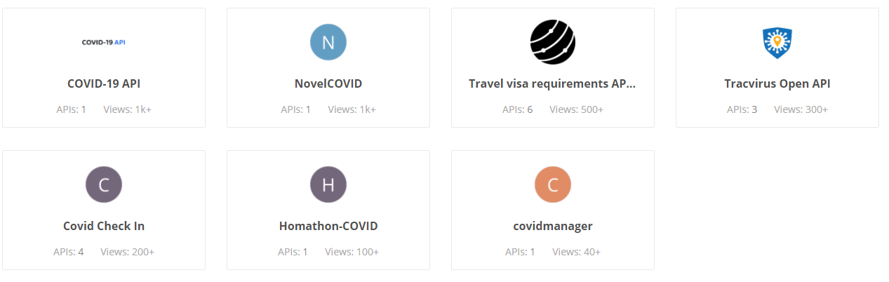

### Components:
#### Solution:

A covid dashboard containing browsable graphs, which re

1. ui:

   - reactjs + Material-UI
   - graphQL client
   - s3 hosted
   - responsive : laptop, tablet, mobile screen size
   - countries should be configurable, default being india.
   - 

   

2. service:

   - cache data in database, webhook to pull data
   - spring-boot
   - graphQL data endpoint, REST auth endpoint
   - aws deployed with LB.


#### Design constraints:

- Which api to use to get covid data? (whether to take server-push approach?)

  https://explore.postman.com/network/search?q=covid

  

  1. covid-19 api:

     - updates once in a day. --> update new day data at 00:01 AM, https://covid19-api.org/api/status/:country?date=2020-03-27 

     - Structure of covid data

     ```json
     {
             "country": "IN",
             "last_update": "2020-10-29T01:25:10",
             "cases": 7990322,
             "deaths": 120010,
             "recovered": 7259509
     },
     ```

     

  2. NovelCovid api:

     updates in: 

     ```json
     {
         "updated": 1603994373626,
         "country": "India",
         "countryInfo": {
             "_id": 356,
             "iso2": "IN",
             "iso3": "IND",
             "lat": 20,
             "long": 77,
             "flag": "https://disease.sh/assets/img/flags/in.png"
         },
         "cases": 8038765,
         "todayCases": 49912,
         "deaths": 120563,
         "todayDeaths": 509,
         "recovered": 7314951,
         "todayRecovered": 57757,
         "active": 603251,
         "critical": 8944,
         "casesPerOneMillion": 5807,
         "deathsPerOneMillion": 87,
         "tests": 105487680,
         "testsPerOneMillion": 76196,
         "population": 1384419342,
         "continent": "Asia",
         "oneCasePerPeople": 172,
         "oneDeathPerPeople": 11483,
         "oneTestPerPeople": 13,
         "activePerOneMillion": 435.74,
         "recoveredPerOneMillion": 5283.77,
         "criticalPerOneMillion": 6.46
     }
     ```

     

  #### Sources:

- Dashboard Idea from: https://www.creative-tim.com/product/light-bootstrap-dashboard-react

- 
